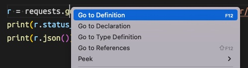
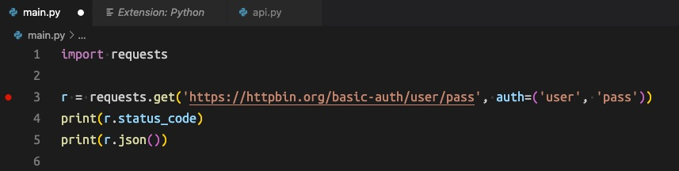
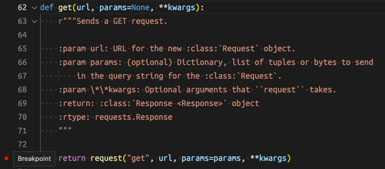

# Quick Example of Debugging Python in VS Code

## Pre-Requirements

- install VS Code
- install the Microsoft Python extension for VS Code (https://marketplace.visualstudio.com/items?itemName=ms-python.python)
- ensure you have a modern install of Python (3.10+)
  
## Setup

- pull this code from github
- [Recommended/Optional] create a virtual environment with `python -m venv venv`
- install depenencies using `pip install -r requirements.txt`
- Open this project up in VS Code and make sure that VS Code is using the version of Python from your virtual environment (use `python select interpreter` in the command pallet)

## Debugging Your Own Code

1. Open `main.py`
2. Place breakpoint on line 3 where requests is called (click to the left of the line and line number). A red dot appears.
3. Click the Run and Debug button on the side bar and start debugging.
4. You will be asked what you're debugging. Choose to debug a python file.
5. VS Code should break into the debugger on line 3.

## Debugging Someone Else's Code

These steps have already been done in the project.

1. Click the Run and Debug button on the side bar
2. Choose to create a `launch.json` file 
3. VS Code will create `launch.json` and present it to you
4. Change `"justMyCode": true` to be `"justMyCode": false`
5. Start debugging as before

Now, VS Code should attempt to step into code in other packages.

## Setting a Breakpoint in Other People's Code

One way to do this is to start from YOUR code, and navigate to the place you want to set the breakpoint.

For example...

1. Open `main.py`
2. Right click on the `get` on line 3 and choose "Go to Definition"
3. This should show you the code for Request's `get` method. Place a breakpoint in here somewhere
4. Start debugging as before. You may see this breakpoint hit BEFORE line 3 of `main.py` depending upon where you set the breakpoint, and what other code calls this method.

## Examples

### Screenshot of Go to Defintion feature in VS Code

### Screenshot of a breakpoint set in my code

### Screenshot of a breakpoint set in other people's code

Copyright 2022 Martin Peck